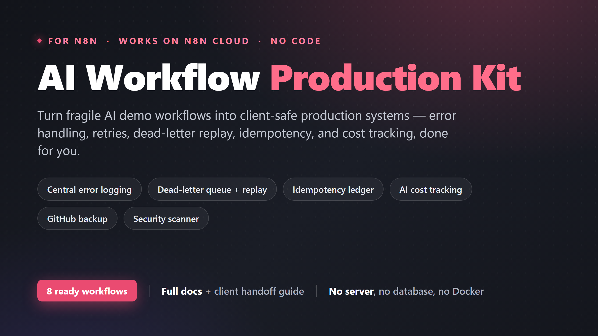
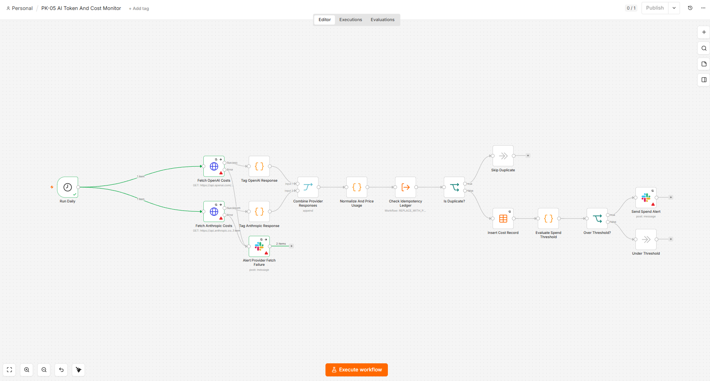
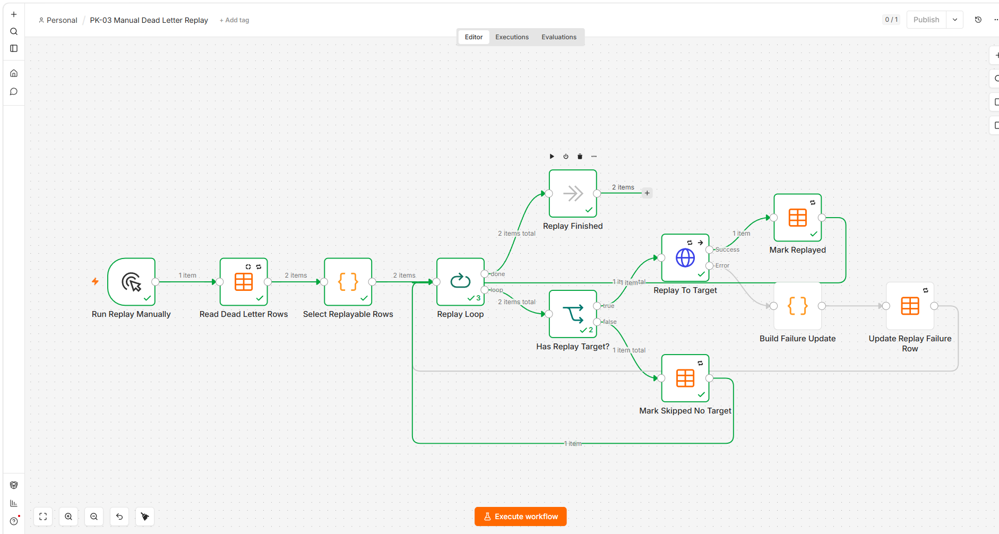
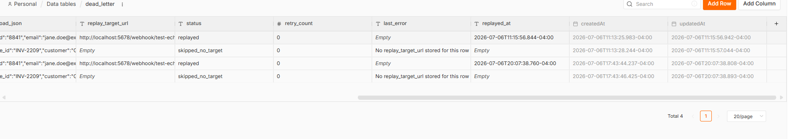
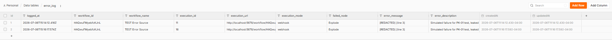

# n8n AI Workflow Production Kit

> Turn fragile AI demo workflows into client-safe production systems - error
> handling, retries, dead-letter replay, idempotency, and cost tracking,
> already built for you. **Free, open-source, and runs on n8n Cloud with no
> database, no server, and no code.**

## Why this exists

Most n8n demos work once in the editor, then fall over in production: no
retries, no dead-letter storage, no idempotency, no observability, no backup.
The patterns to fix this *do* exist - but they're scattered across blog posts
and single-trick templates, and almost all of them assume you'll run Postgres
or Redis.

This kit assembles the whole production operating layer into **8 workflows
that work together**, fully documented, storing everything in **n8n's built-in
Data Tables** - so there's nothing to install and it runs on n8n Cloud as-is.
If you can fill in a form, you can use it.

## What's inside

| # | Workflow | What it does |
|---|----------|--------------|
| PK-00 | Setup Data Tables | One click creates the kit's four storage tables inside n8n |
| PK-01 | Central Error Logger | Global error workflow: sanitized log + Slack alert with email fallback |
| PK-02 | Dead Letter Queue Writer | Stores failed payloads so they're never lost |
| PK-03 | Manual Dead Letter Replay | Re-runs failed payloads with capped retries and status tracking |
| PK-04 | Idempotency Ledger | Deterministic event keys so re-runs never duplicate records |
| PK-05 | AI Token & Cost Monitor | Daily OpenAI + Anthropic spend tracking with threshold alerts |
| PK-06 | GitHub Workflow Backup | Nightly backup of all workflows, committing only real changes |
| PK-07 | Pre-Export Security Scanner | Scans your workflows for leaked keys, tokens, and real emails |

Plus full docs: [INSTALL](products/n8n-ai-production-kit/docs/INSTALL.md) ·
[TROUBLESHOOTING](products/n8n-ai-production-kit/docs/TROUBLESHOOTING.md) ·
[COMPATIBILITY](products/n8n-ai-production-kit/docs/COMPATIBILITY.md) ·
[CLIENT-HANDOFF](products/n8n-ai-production-kit/docs/CLIENT-HANDOFF.md) ·
[CHANGELOG](products/n8n-ai-production-kit/docs/CHANGELOG.md), plus fake test
data for safe testing.

## Quick start (about 20 minutes)

1. **Get n8n** - sign up free at [n8n.io](https://n8n.io) (runs in your
   browser) or self-host. No other accounts required to start.
2. **Download** the latest kit ZIP from the
   [Releases page](https://github.com/Stava-Java/n8n-ai-production-kit/releases)
   (or clone this repo).
3. **Import** the 8 files from `products/n8n-ai-production-kit/workflows/`
   into n8n (Workflows → Import from File).
4. **Run PK-00 once** to create the storage tables.
5. **Fill in the purple Settings node** on each workflow - that's your config
   (Slack channel, thresholds, etc.). No environment variables.

Full step-by-step with screenshots:
**[docs/INSTALL.md](products/n8n-ai-production-kit/docs/INSTALL.md)**. Every
workflow also has a plain-English Setup Note right on its canvas.

## Screenshots

| | |
|---|---|
|  |  |
|  |  |

## Free & open

This kit is **MIT-licensed** - use it in client work, fork it, build on it,
whatever helps. It costs nothing.

If it saves you time, the one thing that genuinely helps this project reach
more people is a **⭐ star** - it's how others find it.

Found a bug or have an idea? [Open an issue](https://github.com/Stava-Java/n8n-ai-production-kit/issues)
or read [CONTRIBUTING.md](CONTRIBUTING.md). Contributions welcome.

## Advanced

- **Self-hosting with Docker** is optional - see
  [INSTALL Appendix A](products/n8n-ai-production-kit/docs/INSTALL.md).
- **Higher volume?** Swap the Data Table nodes for Postgres; every read/write
  is isolated in a single node to make that easy.
- **Runtime license checks** (`shared/license-worker/`) are optional and off
  by default - you don't need them.

---

Built by **Satva Patel**. If this helped, a ⭐ means a lot.
